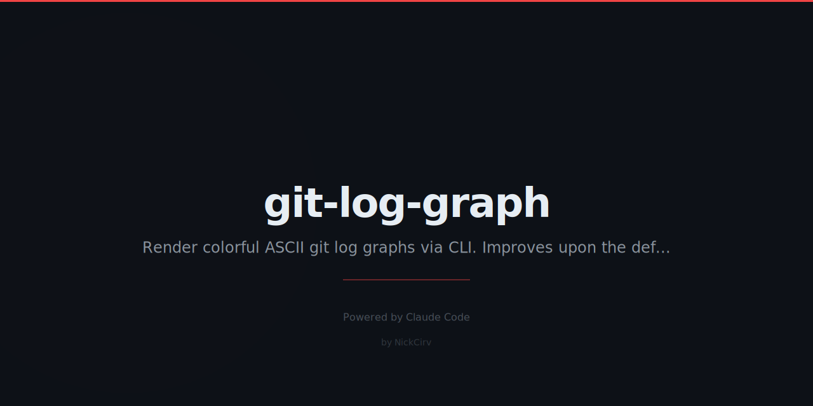

# git-log-graph

Beautiful, colorful ASCII git log graph — better than `git log --graph`.

```
  git-log-graph  my-repo  main

  ● 3f4a1c2 2h ago  [JD] feat: add dark mode toggle
  │ ● 9b2e8f1 3d ago  [AB] fix: resolve race condition in auth
  ├─╯
  ● 71c4d90 1w ago  [JD] chore: update dependencies
  ● a2b8e33 2w ago  [MC] feat: initial schema validation
```

Zero external dependencies. Pure Node.js built-ins only.

## Install

```sh
npm install -g git-log-graph
```

Or run directly with npx:

```sh
npx git-log-graph
```

## Usage

```sh
git-log-graph [options]
glg [options]          # short alias
```

### Options

| Flag | Description | Default |
|------|-------------|---------|
| `--count <n>` | Limit commits shown | 100 |
| `--all` | Show all branches | current branch |
| `--author <name>` | Filter by author name | — |
| `--since <date>` | Filter by date, e.g. `"2 weeks ago"` | — |
| `--search <text>` | Filter commits by message | — |
| `--stat` | Show files changed per commit | off |
| `--compact` | One-line-per-commit mode | off |
| `--help, -h` | Show help | — |

### Examples

```sh
# Show last 50 commits
git-log-graph --count 50

# Show all branches
git-log-graph --all

# Filter by author
git-log-graph --author "Jane Doe"

# Commits from the last week
git-log-graph --since "1 week ago"

# Search commit messages
git-log-graph --search "feat"

# Show file stats per commit
git-log-graph --stat

# Compact one-line mode
git-log-graph --compact

# Combine filters
git-log-graph --all --author "Jane" --since "2 weeks ago"
```

## Features

- **Colored branch lanes** — each active branch gets a distinct ANSI color
- **Author initials** — `[JD]` for Jane Doe, color-coded per author
- **Relative dates** — `2h ago`, `3d ago`, `2w ago`, `4mo ago`
- **Merge connectors** — `╮` / `╯` lines show merge points visually
- **Smart pager** — auto-paginates long output (j/k/q controls)
- **Compact mode** — one line per commit for dense overviews
- **Stat mode** — files changed per commit inline

## Pager Controls

When output exceeds terminal height, the built-in pager activates:

| Key | Action |
|-----|--------|
| `j` / `↓` | Scroll down |
| `k` / `↑` | Scroll up |
| `Space` / `PgDn` | Page down |
| `PgUp` | Page up |
| `g` | Jump to top |
| `G` | Jump to bottom |
| `q` | Quit |

## Requirements

- Node.js 18+
- Git installed and in PATH

## License

MIT
